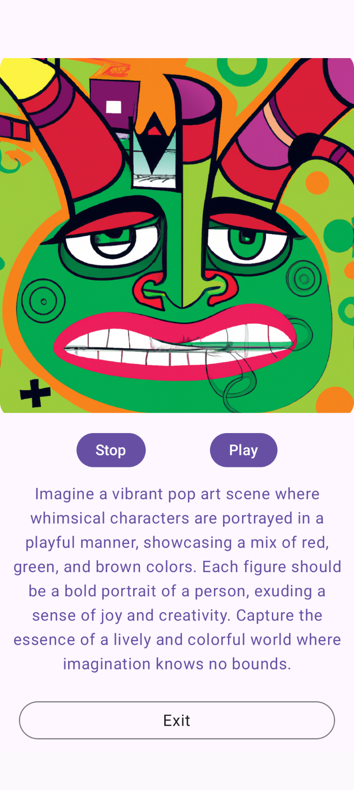
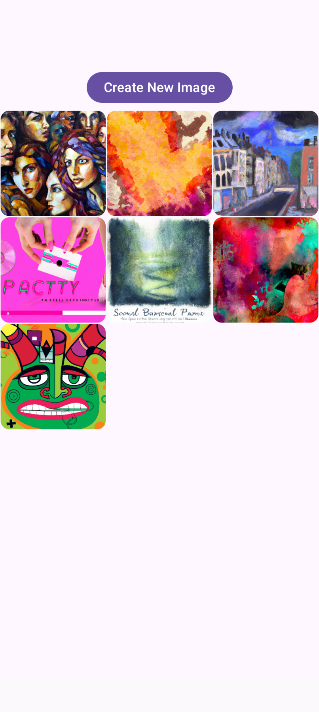
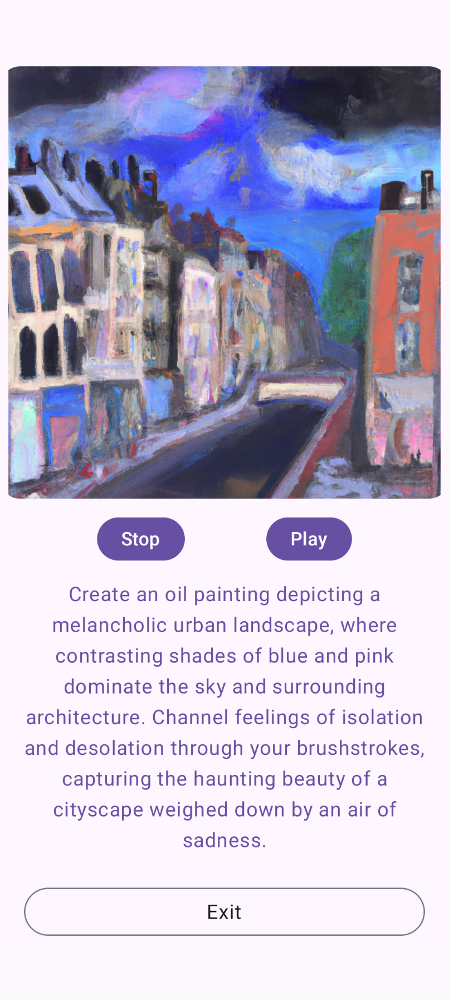

<h1>AutoArtist</h1>

This is a Kotlin Multiplatform project targeting Android and iOS.

### How It Works
<ol>
  <li>User answers a series of questions.</li>
  <li>Answers are sent to GPT API for a descriptive image prompt.</li>
  <li>Prompt is sent to DALL-E 3 API to generate an image.</li>
  <li>Prompt is also sent to a text-to-audio service to create an MP4 file.</li>
  <li>The generated image is stored in Room, while the MP4 file is written to local storage for later viewing.</li>
</ol>

### Screenshots

  
  
   

### Key Features
<ol>
  <li><strong>Compose Multiplatform UI:</strong> Unified user interface for Android and iOS.</li>
  <li><strong>Dynamic Questionnaires:</strong> Users answer questions to define preferences (e.g., colors, themes).</li>
  <li><strong>AI-Powered Prompts:</strong> User inputs are sent to GPT API to generate detailed image prompts.</li>
  <li><strong>DALL-E 3 Integration:</strong> Generated prompts are used to create unique images with DALL-E 3.</li>
  <li><strong>Text-to-Audio:</strong> Prompts are converted into MP4 audio files using a text-to-audio service.</li>
  <li><strong>Room Database:</strong> Prompts and images are stored in Room for a gallery view. Audio files are saved to local storage.</li>
  <li><strong>Dependency Injection:</strong> Koin is used for managing dependencies efficiently across modules.</li>
</ol>

<h2>Technologies Used</h2>
<ul>
  <li><strong>Kotlin Multiplatform Mobile (KMM):</strong> For shared codebase across platforms.</li>
  <li><strong>Jetpack Compose Multiplatform:</strong> For building the user interface.</li>
  <li><strong>OpenAI GPT API:</strong> To generate descriptive prompts based on user input.</li>
  <li><strong>DALL-E 3 API:</strong> To generate images from the prompts.</li>
  <li><strong>Text-to-Audio API:</strong> To convert prompts into audio files.</li>
  <li><strong>Room Database:</strong> Persists prompts and images for later use, while audio files are kept in local storage.</li>
  <li><strong>Koin:</strong> For dependency injection and efficient module management.</li>
</ul>

<h2>Learn More</h2>

Learn more about <a href="https://www.jetbrains.com/help/kotlin-multiplatform-dev/get-started.html">Kotlin Multiplatform</a>.

